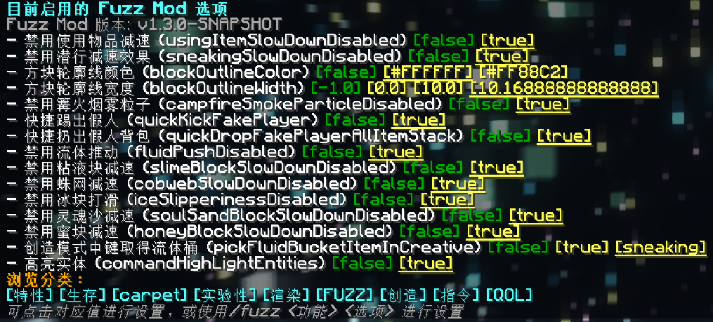

# Fuzz

**中文** | [English](./README_EN.md)

一款使用[Carpet Mod](https://github.com/gnembon/fabric-carpet)操作逻辑的客户端模组，提供了一些实用功能。

默认情况下，所有功能处于禁用状态。

---

---

## 快速入门

- 主命令

  - /fuzz
    - /fuzz list

      - /fuzz list <分类标签>

    - /fuzz <规则> <选项>

  /fuzz: 查看当前已启用的规则列表

  /fuzz list: 查看完整规则列表

  /fuzz list <分类标签>: 查看指定分类标签下的规则列表

  /fuzz <规则> <选项>: 修改指定规则的选项

## 文档

- [规则](./docs/rules.md)
- [指令](./docs/commands.md)
- [开发](./docs/development.md)

## 许可
此项目在 [ LGPL-v3.0 ](https://choosealicense.com/licenses/lgpl-3.0/) 许可证下可用,您可以随意从中学习并将其纳入您自己的项目中。