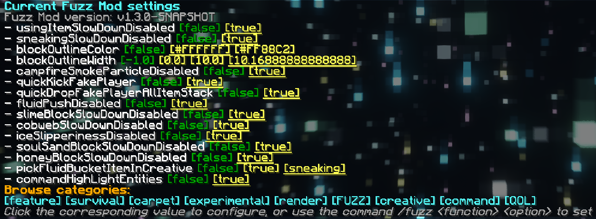

# Fuzz

[中文](./README.md) | **English**

A client-side mod using [Carpet Mod](https://github.com/gnembon/fabric-carpet) operation logic, providing some useful features. 

All features are disabled by default.

---

---

## Quick Start

- Main Command

  - /fuzz
  
    - /fuzz list

      - /fuzz list &lt;category&gt;

    - /fuzz &lt;rule&gt; &lt;option&gt;

  /fuzz: View the list of currently enabled rules

  /fuzz list: View full list of rules

  /fuzz list &lt;category&gt;: View the list of rules under the specified category tag

  /fuzz &lt;function&gt; &lt;option&gt;: Modify options for the specified rule

## Document

- [Rules](./docs/en/rules_en.md)
- [Commands](./docs/en/commands_en.md)
- [Development](./docs/en/development_en.md)

## License
This project is available under the [ LGPL-v3.0 ](https://choosealicense.com/licenses/lgpl-3.0/) license. Feel free to learn from it and incorporate it in your own projects.